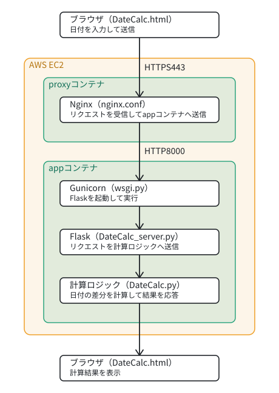
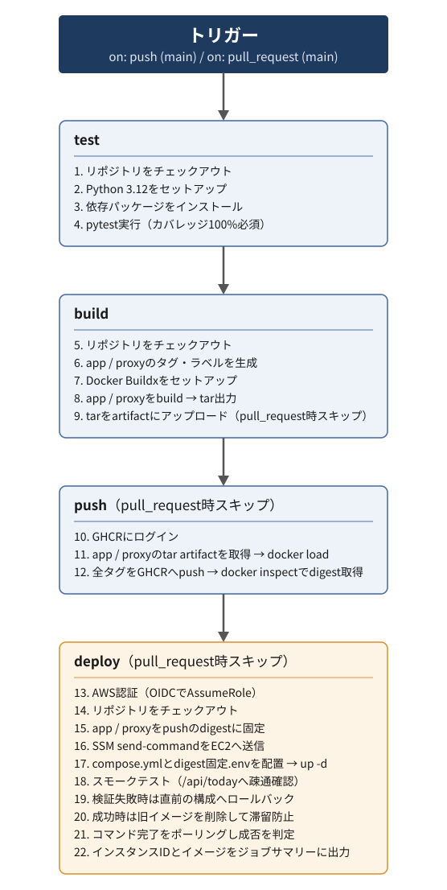

# 日数計算機

日数計算を行うWebアプリケーションです。HTTPSに対応しています。  
AWS EC2上でコンテナ運用し、GitHub ActionsによるCI/CDを構築しています。

**Webアプリケーション**  
https://datecalc.duckdns.org/

---

## 主な機能

- 現在の日付と入力した日付の差分を日数で表示（365日以上は年数も併記）
- 紀元前999年から西暦9999年まで対応
- 紀元前の年は負数で入力（例：-100年1月1日 = 紀元前100年1月1日）
- 曜日の表示
- 計算履歴の表示（最大8件、重複は自動排除）

**テストカバレッジレポート**  
https://horikawatakato.github.io/datecalc/coverage-report.html

---

## ファイル構成

```
datecalc/
├── .github/
│   └── workflows/
│       └── cicd.yml                # GitHub Actions（CI/CD）
│
├── app/
│   ├── src/
│   │   ├── DateCalc.py             # 計算ロジック
│   │   ├── DateCalc_server.py      # flask webサーバー（API）
│   │   └── wsgi.py                 # gunicornエントリポイント
│   ├── static/
│   │   └── DateCalc.html           # webフロントエンド
│   ├── tests/
│   │   ├── test_DateCalc.py        # ユニットテスト（pytest）
│   │   └── test_DateCalc_server.py # ユニットテスト（flask）
│   │
│   ├── .dockerignore               # Dockerビルド除外設定
│   ├── Dockerfile                  # appコンテナイメージ用
│   ├── gunicorn.conf.py            # gunicorn設定
│   ├── pytest.ini                  # pytest設定
│   ├── requirements-dev.txt        # 開発用依存パッケージ（pytest）
│   └── requirements.txt            # 依存パッケージ（flask・gunicorn）
│
├── docs/
│   ├── cicd-workflow.svg           # CI/CDワークフロー図
│   ├── container-architecture.svg  # コンテナ構成図
│   └── coverage-report.html        # テストカバレッジレポート
│
├── nginx/
│   ├── Dockerfile                  # proxyコンテナイメージ用
│   └── nginx.conf                  # リバースプロキシ設定
│
├── scripts/
│   └── init-letsencrypt.sh         # 初回証明書取得スクリプト
│
├── .gitignore                      # Git管理除外設定
├── docker-compose.yml              # コンテナ構成定義
├── LICENSE                         # MITライセンス
└── README.md                       # プロジェクト説明
```

<br>

---

## コンテナ構成

<br>

| コンテナ | 役割 |
|---|---|
| **proxy** | ・リバースプロキシかつTLS終端<br>・443ポート：HTTPSを復号してappコンテナへ転送<br>・80ポート：ACMEチャレンジの受付とHTTPSへのリダイレクト<br>・6時間ごとに自動リロードして更新後の証明書を反映 |
| **app** | ・アプリ本体（Gunicorn + Flask + 計算ロジックDateCalc.py）<br>・8000ポート：外部には非公開でproxyコンテナからのみアクセス可能 |
| **cert** | ・12時間ごとに証明書の更新を試行<br>・有効期限が残り30日以下の証明書のみ実際に更新（初回発行は対象外） |

<br>

**ACMEチャレンジ**  
Let's Encryptが証明書を発行・更新する前に行う「あなたが本当にそのドメインを管理・操作できる立場にあるか」の確認

<br>



---

## GitHub Actions（CI/CD）

<br>



<br>
<br>
<br>

---

Copyright (c) 2026 Horikawa Takato  
Released under the MIT License
