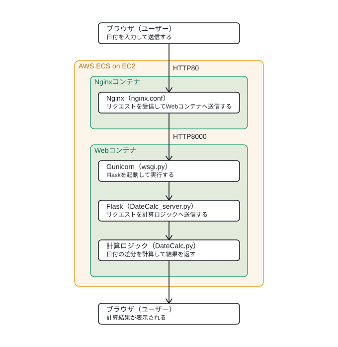
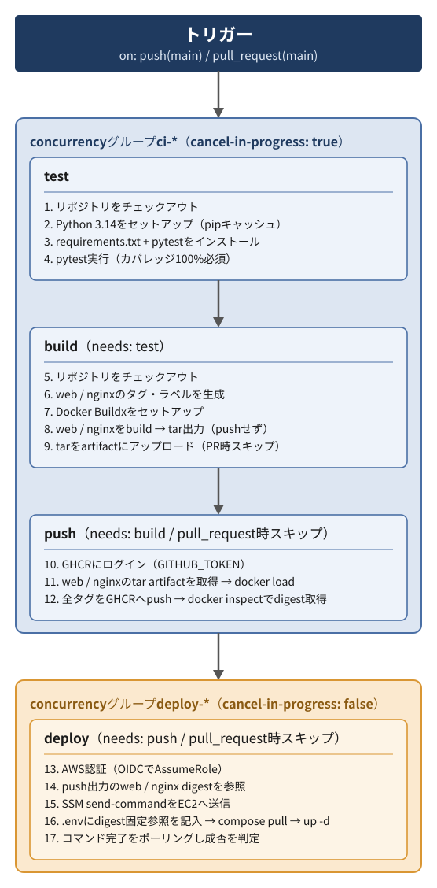

# 日数計算機

日数計算を行うWebアプリケーションです。HTTPSに対応しています。  
AWS EC2上でコンテナ運用し、GitHub ActionsによるCI/CDを構築しています。

**Webアプリケーション**  
https://datecalc.duckdns.org/

---

## 主な機能

- 現在の日付と入力した日付の差分を日数で表示（365日以上は年数も併記）
- 紀元前999年から西暦9999年まで対応
- 紀元前の年は負数で入力（例：-100年1月1日 = 紀元前100年1月1日）
- 曜日の表示
- 計算履歴の表示（最大8件、重複は自動排除）

**テストカバレッジレポート**  
https://horikawatakato.github.io/datecalc/coverage-report.html

---

## ファイル構成

```
datecalc/
├── .github/
│   └── workflows/
│       └── cicd.yml            # GitHub Actions
├── app/
│   ├── DateCalc.html           # Webフロントエンド
│   ├── DateCalc.py             # 計算ロジック
│   ├── DateCalc_server.py      # Flask Webサーバー（API）
│   ├── Dockerfile              # Webコンテナイメージ用
│   ├── gunicorn.conf.py        # Gunicorn設定
│   ├── requirements.txt        # 依存パッケージ（Flask・Gunicorn）
│   ├── test_DateCalc.py        # ユニットテスト（pytest）
│   └── wsgi.py                 # Gunicornエントリポイント
├── docs/
│   └── coverage-report.html    # テストカバレッジレポート
├── nginx/
│   ├── Dockerfile              # Nginxコンテナイメージ用
│   └── nginx.conf              # リバースプロキシ設定
├── .gitignore                  # Git管理除外設定
├── LICENSE                     # MITライセンス
├── README.md                   # プロジェクト説明
├── cicd-workflow.svg           # CI/CDワークフロー図
├── container-architecture.svg  # コンテナ構成図
└── docker-compose.yml          # コンテナ構成定義
```

---

## コンテナ構成

| コンテナ | 役割 | ポート |
|---|---|---|
| **nginx** | ・リバースプロキシかつTLS終端<br>・HTTPSを復号してwebコンテナへ転送し、HTTPはHTTPSへリダイレクト<br>・証明書反映のため6時間ごとに自動リロード（80ポート） | 443 / 80 |
| **web** | ・アプリ本体（Gunicorn + Flask）<br>・日数計算を処理して応答<br>・外部には非公開でnginxコンテナからのみアクセス | 8000 |
| **certbot** | ・Let's Encrypt証明書の自動更新<br>・12時間ごとに確認し、共有ボリュームでnginxコンテナに受け渡す |  |



---

## GitHub Actions（CI/CD）

mainへのpushとpull requestをトリガーに実行

- **push**：test → build → push → deployすべて実行
- **pull request**：test → buildのみ実行（pushとdeployはスキップ）

同時実行制御（concurrency）はジョブ単位で設定
 
- **test / build / push**：古いコミットの実行をキャンセルし、最新コミットを優先
- **deploy**：実行中はキャンセルせず、新しい実行は前のデプロイ完了まで待機



<br>
<br>
<br>
<br>
<br>

---

Copyright (c) 2026 Horikawa Takato  
Released under the MIT License
