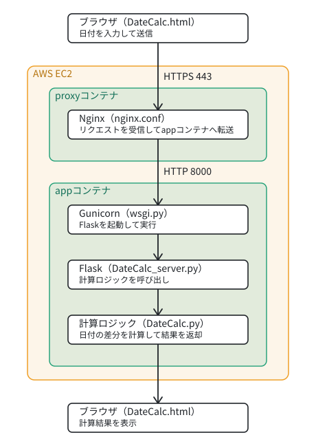
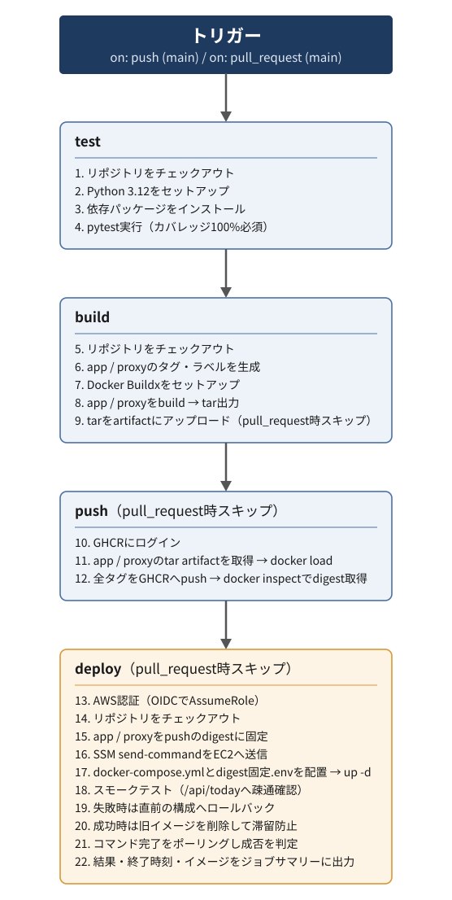

# 日数計算機

**日数計算を行うWebアプリケーション**  
**https://datecalc.duckdns.org/**

<br>

---

## 機能

- 現在の日付と入力日付の差分を日数で表示（365日以上は年数も併記）
- 紀元前999年〜西暦9999年に対応（紀元前の年は負数で入力）
- 曜日の表示

<br>

---

## 構築内容

- AWS EC2でNginxをリバースプロキシかつTLS終端として使用したコンテナ構成を構築
- GitHub Actionsでテスト→ビルド→プッシュ→デプロイを自動化したCI/CDパイプラインを構築
- デプロイ後のスモークテストと失敗時の自動ロールバックを実装

<br>

---

## 使用技術

<br>

| 分類 | 技術 |
|---|---|
| AWS | EC2、Systems Manager、IAM（OIDC連携）、CloudWatch Logs |
| インフラ | Docker、Docker Compose、Nginx、Let's Encrypt（Certbot） |
| CI/CD | GitHub Actions、GHCR（GitHub Container Registry） |
| アプリ | Python 3.12、Flask、Gunicorn、pytest、HTML/JavaScript |

<br>

---

## コンテナ構成

<br>

| コンテナ | 役割 |
|---|---|
| **proxy** | ・リバースプロキシかつTLS終端<br>・443ポート：HTTPSを復号してappコンテナへ転送<br>・80ポート：ACMEチャレンジの受付とHTTPSへのリダイレクト<br>・6時間ごとに自動リロードして更新後の証明書を反映 |
| **app** | ・アプリ本体（Gunicorn + Flask + 計算ロジック）<br>・8000ポート：外部からはproxyコンテナ経由でのみアクセス可能 |
| **cert** | ・12時間ごとに証明書の更新を試行<br>・有効期限が残り30日以下（Certbotの既定値）の証明書のみ実際に更新（初回発行は対象外） |

<br>

**ACMEチャレンジ**  
Let's Encryptが証明書を発行・更新する前に行う「あなたが本当にそのドメインを管理・操作できる立場にあるか」の確認

<br>

<p align="center">
  
</p>

<br>

---

## CI/CDパイプライン

<br>

<p align="center">
  
</p>

<br>

---

## ファイル構成

<br>

```
datecalc/
├── .github/
│   └── workflows/
│       └── cicd.yml                # GitHub Actions（CI/CD）
│
├── app/
│   ├── src/
│   │   ├── DateCalc.py             # 計算ロジック
│   │   ├── DateCalc_server.py      # Flask Webサーバー（API・HTML配信）
│   │   └── wsgi.py                 # Gunicornエントリポイント
│   ├── static/
│   │   └── DateCalc.html           # Webフロントエンド
│   ├── tests/
│   │   ├── test_DateCalc.py        # ユニットテスト（計算ロジック）
│   │   └── test_DateCalc_server.py # ユニットテスト（Webサーバー）
│   │
│   ├── .dockerignore               # Dockerビルド除外設定
│   ├── Dockerfile                  # appコンテナイメージ用
│   ├── gunicorn.conf.py            # Gunicorn設定
│   ├── pytest.ini                  # pytest設定
│   ├── requirements-dev.txt        # 開発用依存パッケージ（pytest・pytest-cov）
│   └── requirements.txt            # 依存パッケージ（flask・gunicorn）
│
├── docs/
│   ├── cicd-pipeline.svg           # CI/CDパイプライン図
│   └── container-architecture.svg  # コンテナ構成図
│
├── proxy/
│   ├── Dockerfile                  # proxyコンテナイメージ用
│   └── nginx.conf.template         # リバースプロキシ設定（TLS終端）
│
├── scripts/
│   └── bootstrap-https.sh          # HTTPS初回セットアップスクリプト
│
├── .gitattributes                  # 改行コード設定（LF固定）
├── .gitignore                      # Git管理除外設定
├── docker-compose.yml              # コンテナ構成定義
├── LICENSE                         # MITライセンス
└── README.md                       # プロジェクト説明
```

<br>
<br>
<br>

---

Copyright (c) 2026 Horikawa Takato  
Released under the MIT License
